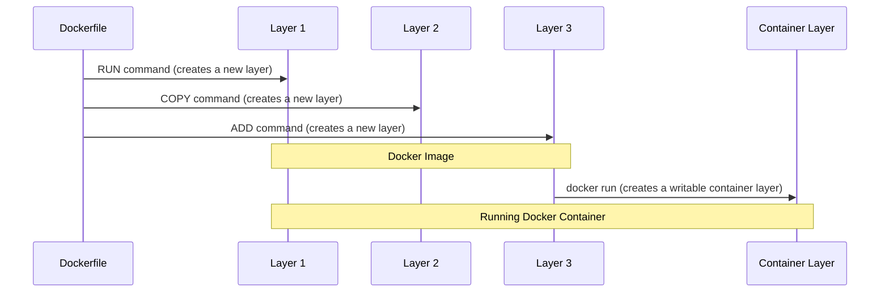

# Docker 简明教程

> **我使用的环境**
>
> - 操作系统：CentOS 7.9
> - Docker 版本：24.0.2


## 概述

Docker是一个开源的容器引擎，改变了开发、分发和运行软件的方式，为开发者和运维人员提供了一种更简洁、更高效的方法来处理应用的打包、分发和部署。

1. **简化了应用部署**：在Docker出现之前，开发人员和运维人员经常面临一个难题，即"在我的机器上可以运行，为什么在你的机器上就不行?"。Docker通过将应用及其所有依赖项打包到一个容器中，从而确保应用在任何支持Docker的平台上都可以一致地运行，解决了这个问题。
2. **推动了微服务架构的发展**：微服务架构是将一个大型应用拆分为多个独立运行、各自独立开发和部署的小服务。Docker提供了一种理想的方式来运行、管理和协调这些微服务。每个服务可以被封装在一个Docker容器中，各自独立运行和扩展。
3. **促进了DevOps文化的发展**：DevOps是一种强调开发（Dev）和运维（Ops）紧密合作的文化和实践。Docker通过提供一种应用的打包、分发和运行方式，使得开发和运维的工作更加紧密地结合在一起，推动了DevOps文化的发展。
4. **加速了云计算的发展**：云服务提供商，如Amazon AWS、Google Cloud、Microsoft Azure等，都提供了对Docker容器的原生支持，使得在云环境中运行和管理Docker容器变得非常简单。同时，新的云原生技术，如Kubernetes等，也都与Docker紧密集成，进一步推动了云计算的发展。

## Docker Hub

在正式开始使用 Docker 前，请注册一个 [Docker Hub](https://hub.docker.com/) 账号。Docker Hub 是一个用于存储和分发 Docker 镜像的公共注册服务，类似于编程语言的包管理器（如 Python 的 PyPI 或 Node.js 的 npm）中的仓库，但用于存储 Docker 镜像。它的模式类似于 GitHub，你可以下载公共镜像文件，以及上传自己的镜像文件。

## 安装

### [Docker Engine](https://docs.docker.com/engine/)

Docker 引擎是一个典型的 C/S（客户端/服务器）应用，包括三部分：

- 服务器（也叫做Docker daemon，即Docker守护进程）；
- REST API（定义程序用来与Docker daemon交互的接口）；
- 客户端（命令行接口（CLI），Docker 命令））。

**如果你在服务器上或者虚拟机里使用 Docker，请安装 Docker Engine。**

安装指导：

- [CentOS](https://docs.docker.com/engine/install/centos/)
- [Ubuntu](https://docs.docker.com/engine/install/ubuntu/)
- [Debian](https://docs.docker.com/engine/install/debian/)

另外，官方提供了一个安装脚本，此脚本不适合生产环境使用，具体注意事项请参考[脚本说明](https://docs.docker.com/engine/install/debian/)。

```shell
curl -fsSL https://get.docker.com | bash -s docker --mirror Aliyun
```


### [Docker Desktop](https://docs.docker.com/desktop/)

Docker Desktop 是一个一键安装 Docker 的应用程序,并且提供了图形化界面。

安装程序包含了：

- Docker Engine（引擎）；
- Docker CLI（客户端）；
- Docker Compose（一个用于定义和运行多容器Docker应用的工具）；
- 其他特性（如Kubernetes的集成，文件分享和网络设置等）。

**如果你在自己的电脑上学习和操作，请安装 Docker Desktop**

安装指导：

- [Mac 安装](https://docs.docker.com/desktop/install/mac-install/)
- [Windows 安装](https://docs.docker.com/desktop/install/windows-install/)
- [Linux 安装](https://docs.docker.com/desktop/install/linux-install/)

> **注意**
>
> Docker Desktop 图形化界面不支持创建容器，Windows需要借助 CMD、PowerShell（Mac需要借助终端）使用 Docker 命令交互。
>
> - Windows 推荐 Windows Terminal终端工具
> - Mac 推荐使用 item2
> - 另外，推荐使用 VSCode 编辑器，微软为其开发了很多好用的容器插件，例如：Docker、remote-containers、Kubernetes等等。

### 验证

打开终端执行`docker version` 显示版本信息，若看到版本信息即表示安装成功。另外还可以输入：

- `docker info` ：显示整个 Docker 的系统信息；
- `docker run hello-world`：运行 hello-world 容器（IT 祖传技能）。

关于 docker 命令使用，可以使用 docker --help or `docker command --help` 获取提示信息。

## Docker 命令结构

旧的：docker <command> (options)

例如:

```shell
docker run hello-world
```

新的：docker <command> <sub-command>(options)

例如：

```
docker container run hello-world
```

他们的输出结果一样，原来的`docker run `命令后续版本也是兼容的，新版本的`docker container run hello-world`命令意思更直观。

## 容器 VS 虚拟机

容器是一种更小更轻便的虚拟化技术。

### 主要区别：

|          | 容器                                                         | 虚拟化                                                       |
| :------- | :----------------------------------------------------------- | :----------------------------------------------------------- |
| 系统级别 | 容器共享主机的操作系统内核，并在用户空间运行。每个容器都有自己的进程空间，文件系统，网络栈等。 | 虚拟机每个都有自己的完整操作系统，包括内核和用户空间，运行在硬件虚拟化层之上。 |
| 资源使用 | 容器只需要加载运行应用所需的库和二进制文件，因此启动更快，占用的资源更少。 | 虚拟机需要运行完整的操作系统，因此会占用更多的系统资源，如CPU，内存和磁盘空间。 |
| 隔离性   | 容器的隔离主要依赖于 Linux 的 Namespace 和 Cgroups，它们在一定程度上隔离了进程空间，网络，文件系统和资源使用等。 | 虚拟机提供了更强的隔离性，因为每个虚拟机都运行在自己的操作系统中，彼此之间完全隔离。 |
| 便携性   | 容器可以在任何运行 Docker 或兼容 OCI 标准的平台上运行，提供了“一次打包，到处运行”的能力。 | 虚拟机也具有便携性，但由于其包含完整的操作系统，因此在迁移时可能会遇到更多的兼容性问题。 |
| 应用场景 | 容器适合微服务架构，CI/CD，DevOps 等快速迭代和高扩展性的场景。 | 虚拟机适合需要完整操作系统环境的应用，或需要更强隔离性的场景。 |

### 主要共同点：

| 共同点           | 容器和虚拟化                                                 |
| :--------------- | :----------------------------------------------------------- |
| **隔离性**       | 容器和虚拟化都提供了运行环境的隔离，可以在隔离的环境中运行应用，互不干扰。 |
| **提高系统效率** | 两者都可以更高效地利用物理硬件资源，通过在同一台物理机上运行多个虚拟环境来提高资源使用效率。 |
| **提高可移植性** | 两者都能实现应用的封装和打包，增强应用在不同环境中的可移植性。 |
| **方便管理**     | 容器和虚拟化都有配套的管理工具，可以方便地创建、启动、停止和删除环境。 |
| **用于多种场景** | 两者都广泛应用于各种场景，如应用部署、测试、开发环境搭建等。 |

## 运行一个 nginx 容器

```shell
# 下载镜像
docker pull nginx

# 使用 nginx 镜像运行一个容器实例
docker container run --publish 80:80 nginx

# 打开另一个窗口，检查 nginx 是否正常工作
curl localhost:80
```

执行`docker container run`时:

1. 如果本地没有镜像，则会先下载镜像，默认镜像下载地址是 Docker hub；
2. 默认下载最新版本镜像，使用 latest 便签辨识。（ 默认下载 nginx:latest ）；
3. 然后按照指令运行容器，上述例子中添加了一条端口映射，将容器的 80 端口映射到主机的 80端口，通过 `--publish`参数告知 docker 服务器，此参数也可以简写为 `-p`。

通过 `curl`命令，我们可以访问 nginx 的欢迎页面。

```shell
$ curl localhost:80
<!DOCTYPE html>
<html>
<head>
<title>Welcome to nginx!</title>

```

> 关闭容器，请回到终端使用 `control + C`结束，即可

### 进步一步操作

运行一个新的容器，

- 通过 `--name` 指定容器名称；
- 通过 `-d` 参数让容器后台运行；
- 通过镜像标签指定运行版本（nginx:1.24）。

> 为了实验方便，我们可以使用 `--rm` 参数，意思是容器退出后删除容器

```shell
docker container run  --rm  -p 80:80 --name nginx -d nginx:1.24 
```

### 容器操作

- 查看所有容器：`docker ps -a`  或者 `docker container ls -a`；

- 启动容器：`docker start  <容器名称，Hash>` 或者 `docker container stop  <容器名称，Hash>`；
- 停止容器：`docker stop <容器名称，Hash>` 或者 `docker container stop  <容器名称，Hash>` ；
- 删除容器 `docker rm <容器名称，Hash>` 或者`docker container rm  <容器名称，Hash>` ；

### 与容器交互

进入已经运行的容器内部：`docker container exec -it nginx bash`

运行容器并与容器交互：`docker container run --rm -p 81:80 --name nginx-2 -it  nginx:1.24 bash`

- `-it` 选项表示在容器中开启一个交互式的 TTY
- `bash`表示在容器内部运行一个交互式 shell

## 网络

在上面的演示案例中，使用的 -p （--publish）参数公开容器的端口，让我们可以直接访问容器提供的服务。

默认情况下：

- 每个容器连接到一个私有虚拟网络 "桥（brige） "上

- 每个虚拟网络通过主机IP的NAT防火墙进行路由

- 一个虚拟网络上的所有容器都可以相互连通，不需要-p

- 最好的做法是为每个应用程序创建一个新的虚拟网络：

  - 网络 "my_web_app "用于 mysql 和 php/apache 容器

  - 网络 "my_api "用于 mongo 和 nodejs 容器

快速查看容器端口：`docker port <容器名称，Hash>`或者`docker container port  <容器名称，Hash>` ；

### 查看网络

**查看网络：`docker network ls`**

Docker 支持多种类型的网络模式，其中包括 `bridge`、`host` 和 `none`。它们各自的特性和用途如下：

1. **Bridge**：Bridge 网络是 Docker 的默认网络模式。当你创建一个新的 Docker 容器且没有指定网络，Docker 就会将该容器连接到 Bridge 网络。在 Bridge 网络中，每一个 Docker 容器都是在一个隔离的网络环境中运行，容器之间可以通过网络互相通信。此外，容器也可以通过宿主机与外部网络通信，但需要通过端口映射（port mapping）来实现。
2. **Host**：在 Host 网络模式下，Docker 容器共享宿主机的网络命名空间，也就是说，容器会直接使用宿主机的网络。在这种模式下，容器可以直接使用宿主机的网络接口和端口，不需要通过端口映射就可以与外部网络通信。
3. **None**：None 网络模式是一种特殊的网络模式，容器在这种网络模式下会有自己的网络命名空间，但不会进行任何网络设备和端口的配置。因此，容器无法与外部网络通信，也无法与其他容器通信。

这三种网络模式可以满足大部分的使用需求。但在某些复杂的场景中，你可能需要创建自定义的网络。Docker 支持创建自定义的网络，你可以选择使用 Bridge 网络、Overlay 网络或者 MACVLAN 网络等多种类型。自定义网络可以让你更灵活地控制容器的网络环境，例如实现容器间的网络隔离，或者创建跨主机的容器网络等。

**查看网络详细配置：`docker network inspect`**

### 配置一个 nginx 容器的网络连接

```shell
# 创建容器
docker container run --rm -p 80:80 -d --name nginx nginx

# 查看容器网络信息
docker network inspect bridge

# 创建一个新的网络
docker network create my_net --driver bridge

# 将 nginx 的网络连接到 my_net 
docker network connect my_net nginx

# 将 nginx 从bridge断开连接
docker network disconnect bridge nginx

# 查看网络配置信息
docker network inspect bridge 
docker network inspect my_net

# 也可以使用 --network 命令，在创建容器时就指定网络
docker container run --rm -p 80:80 -d --name nginx --network my_net nginx
```

### 默认的网络安全配置

1. 前后端应用位于同一 Docker网络上；
2. 容器间的通信永远不会离开容器；
3. 所有外部暴露的端口默认关闭，需要手动指定暴露端口，使用 -p 或者 --publish；
4. 随着 Swarm 和 Overlay 网络出现，可以处理更复杂的网络要求。

### DNS配置

Docker 的 DNS 解析系统主要用于在 Docker 容器之间进行服务发现。当你使用 Docker 创建网络时，Docker 将在每个网络上自动启动一个 DNS 服务器，并为该网络上的每个容器配置 DNS 客户端，使得容器可以通过服务名进行通信，而不需要知道其他容器的 IP 地址。

- 当你启动一个新的 Docker 容器时，如果你在 `docker run` 命令中使用 `--name` 选项为容器指定了一个名字，那么这个名字就会被 Docker DNS 服务器用作容器的主机名
- Docker DNS 服务器也支持使用别名（alias）。当你在 `docker network connect` 命令中使用 `--alias` 选项时，你可以为一个容器添加额外的别名。

```shell
docker network connect --alias alias1 my_network my_service
```

在这种情况下，`my_network` 网络上的其他容器可以通过 `my_service` 或 `alias1` 来访问 `my_service` 容器。

> **注意**
>
> Docker 的 DNS 解析系统只对同一个网络上的容器有效。如果两个容器不在同一个网络，那么它们不能通过主机名或别名进行通信。如果你希望两个容器能够通过主机名或别名进行通信，你需要确保它们连接到同一个网络。

## 镜像

 官方定义： "镜像是根文件系统变化和相应执行参数的有序集合，在容器运行时使用。"

Docker镜像（Docker Image）是构建Docker容器的基础。它包含了运行一个应用所需的所有内容：应用程序本身、依赖的库、运行环境和系统工具等。

- 镜像是我们想要运行的应用程序

- 容器是该镜像的一个实例，作为一个进程运行。
- 你可以在同一个镜像上运行许多容器
- Docker 的默认镜像 "注册处 "叫做 [Docker Hub](hub.docker.com)

镜像不是一个完整的操作系统，没有内核、内核模块（如驱动）。

### 创建镜像

- 镜像可以使用 Dockerfile 创建，或将已经运行的容器打包成一个镜像。

下面，我们**使用 Dockerfile 文件构建一个Nginx镜像**：

```dockerfile
# 使用 Debian为基础镜像
FROM debian:latest

# 安装依赖
RUN apt-get update \
    && apt-get install -y curl gnupg2 ca-certificates lsb-release \
    && echo "deb http://nginx.org/packages/debian `lsb_release -cs` nginx" \
        | tee /etc/apt/sources.list.d/nginx.list \
    && curl -fsSL https://nginx.org/keys/nginx_signing.key | apt-key add -

# 安装nginx
RUN apt-get update && apt-get install -y nginx

# 将默认的nginx配置文件添加到容器中
# COPY nginx.conf /etc/nginx/nginx.conf

# 将Nginx的日志重定向到Docker的日志收集系统。这样做的好处是您可以通过docker logs命令来查看Nginx的访问和错误日志。
RUN ln -sf /dev/stdout /var/log/nginx/access.log \
    && ln -sf /dev/stderr /var/log/nginx/error.log

# 开放需要的端口
EXPOSE 80 

# 在容器启动时运行 Nginx
CMD ["nginx", "-g", "daemon off;"]
```

将以上内容写入一个名为 Dockerfile 的文件，使用 build 命令构建镜像。

```
docker image build -t customnginx .
```

- `docker image build`: 这是 Docker 的命令，用于从 Dockerfile 构建新的 Docker 镜像。
- `-t customnginx`: `-t` 是指定新构建的 Docker 镜像的标签（或称之为名称）。在这里，新镜像的名称被指定为 `customnginx`。
- `.`: 这指示 Docker 在当前目录查找 `Dockerfile`。

> Dockerhub 上很多镜像都会提供Dockerfile文件，例如 nginx 的 Dockerfile 我们可以进入 [Nginx 的主页](https://hub.docker.com/_/nginx)，在 Overview 下的 Supported tags and respective `Dockerfile` links 看到相关链接。

**使用运行中的容器创建一个镜像**

```shell
# 运行一个 nginx 容器
 docker container run --rm --name nginx -d nginx

# 进入容器，并修改欢迎页面
docker container exec -it nginx bash
echo OK > /usr/share/nginx/html/index.html
# 退出容器
exit

# 打包镜像
docker commit nginx nginx_ok

# 以新镜像创建一个容器 
docker container run --rm --name nginx  -p 80:80 -d nginx_ok

# 访问容器
curl localhost:80

```

### 镜像分层


Docker 镜像是由多个只读层堆叠而成的，每个层代表 Dockerfile 中的一个指令。各层都是增量的，它们将文件的改变保存起来。这些层在构建时一层一层叠加，最终形成了你的 Docker 镜像。

当你启动一个镜像（使用 `docker run`）创建一个容器时，Docker 在镜像的最上方添加了一个新的可写层，我们称之为"容器层"。所有针对运行容器的修改都会应用到这个层上。

镜像的这种分层结构允许 Docker 高效地存储和传输数据。因为每一层都只保存从上一层开始的改动，所以相比于保存整个文件系统的状态，分层存储要节省很多空间。此外，由于每一层都可以在多个镜像之间共享，所以可以进一步节省存储空间和增强效率。

这种分层结构是通过 Dockerfile 的每一行指令创建的。每一行指令都会创建一个新的镜像层并对其进行修改。例如，一个 `RUN` 命令可能会在一个层中安装一个新的软件包，而 `COPY` 命令可能会将一些文件添加到另一个层。当你构建一个新的镜像时，Docker 会逐行执行 Dockerfile 中的指令，并为每一行指令创建一个新的层。

一旦一个镜像被创建并且成功构建，就不能改变它的层。如果你想更改一个已经存在的镜像，你需要创建一个新的镜像，并且可能需要添加或者更改一层。

在运行一个镜像创建容器时，Docker 会在镜像的最顶层添加一个新的可写层，也就是所谓的“容器层”。所有对运行中的容器的修改（例如修改文件，创建新文件等）都会写入这个容器层。




## 存储

Docker 容器的存储主要涉及到两个概念：镜像存储和持久化存储。

1. 镜像存储: Docker 镜像是构建容器的基础，它包含了运行容器所需的所有代码和依赖。每个镜像都是多个层次的只读文件系统的集合。当构建或更新镜像时，Docker 会在已有的只读层上添加一个新的只读层。这些层会被缓存在 Docker 主机的磁盘上。当创建一个新的容器时，Docker 会在镜像的顶层添加一个可写层，这就是容器层。

2. 持久化存储: 默认情况下，容器的数据在容器终止时会丢失，因为 Docker 容器设计为一次性的、不可变的实体。为了在容器之间和容器重启后保留数据，Docker 提供了几种持久化存储的方法：数据卷（volumes）、绑定挂载（bind mounts）和临时文件系统（tmpfs mounts）。

   - 数据卷（Volumes）: Volumes 是 Docker 最推荐的持久化存储方式。它们在 Docker 主机上创建特殊的目录，并允许容器读写这些目录。数据卷可以在多个容器之间共享，并且在容器删除时可以继续存在。（`-v my_volume:/var/lib/mysql`）

   - 绑定挂载（Bind Mounts）: Bind mounts 允许容器访问 Docker 主机上的任意目录或文件。绑定挂载在 Docker 主机上创建的文件和目录在容器内部和外部都有相同的权限。（`-v /path/to/host/dir:/var/lib/mysql`）

   - 临时文件系统（tmpfs Mounts）: tmpfs mounts 在 Docker 主机的内存中创建文件或目录，对容器提供了一个临时的存储空间。当容器停止时，tmpfs mount 中的数据将会丢失。

注意，容器存储的使用和管理需要考虑数据的生命周期、数据的一致性和容器的可移植性等因素。

### Volume

Volume 的主要特性和优点包括：

1. 生命周期独立于容器：Volume 的生命周期独立于任何特定的容器。即使创建 Volume 的容器被删除，Volume 本身和其内容还会保留。
2. 容器间共享：Volume 可以被多个容器同时挂载和共享数据。
3. 数据一致性：Volume 中的数据在任何时候对所有挂载该 Volume 的容器都是可见的，并且可以立即看到其他容器对 Volume 的更改。
4. 主机文件系统隔离：Volume 存在于 Docker 的管理范围之内，不依赖于主机的文件系统。这意味着即使 Docker 容器运行在不同的操作系统或文件系统的主机上，Volume 仍可以正常工作。
5. 安全性：由于 Volume 的内容被 Docker 管理，因此可以通过 Docker 提供的安全机制（如 AppArmor、SELinux、GRSEC 等）来增强其安全性。

**Volume 基本命令**

- 创建 Volume：`docker volume create my-volume`
- 列出所有的 Volume：`docker volume ls`
- 使用 Volume：在运行容器时使用 `-v` 参数挂载 Volume，例如：`docker run -v my-volume:/path/in/container my-image`
- 删除 Volume：`docker volume rm my-volume`

**定义 Volume 的方式**

1. 在 Dockerfile 中声明：

   在 Dockerfile 中定义 VOLUME 很方便，例如，申明 Mysql 的数据存储目录，使用`VOLUME /var/lib/mysql` 。这样创建的 Volume 会在容器启动时自动挂载，挂载路径是 Docker 自动分配的，我们无法控制。如果我们需要把 Volume 挂载到宿主机的指定路径，那么就需要在运行容器的时候，使用 `-v` 参数来指定。

2. 使用 -v 声明：`docker container run --rm -p 3306:3306 -d -v /opt/mysql:/var/lib/mysql mysql`

> **笔记：**
>
> 我们好像没有必要在 Dockerfile 中定义 Volume，在启动容器时，我们使用 -v 就可以完成相应步骤？
>
> 其实不然，
>
> 1. 在 Dockerfile 中定义 `VOLUME` 可以作为一种标识，向使用镜像的人显示哪些路径是设计为持久存储的。这对于后来接手项目的人来说是一个很好的指南。
> 2. 在 Dockerfile 中定义的 volume 在容器删除后会保留，确保关键数据不会丢失。
> 3. 在 Dockerfile 中定义的 volume 可以很容易地在容器之间共享，无论它们是否在同一时刻运行。
> 4. 使用 volume 可以帮助将数据从容器文件系统隔离出来，并可能提高某些类型的磁盘 IO 的性能。

我们使用官方的 mysql 来演示一下，[Dockerfile](https://github.com/docker-library/mysql/blob/1bfa4724fe112b4246672ed2b3c42142f17d5636/8.0/Dockerfile.oracle)中定义了` VOLUME /var/lib/mysql`

```shell
 docker container run --rm -p 3306:3306 -e MYSQL_RANDOM_ROOT_PASSWORD=true mysql

```

-  `-e MYSQL_RANDOM_ROOT_PASSWORD=true` 是让MySQL随机生成一个root密码，密码会输出到日志中，`GENERATED ROOT PASSWORD: NGCQ7C2d97YNPque/wpk+IUOtR2AJ6hg`
- 使用 `--rm` 参数，如果没有定义 `-v` 选项，容器删除时，volume 也会一并删除。（如果你在运行容器时使用了 `--rm` 标志，并且希望保留你的数据，你应该使用命名的数据卷，而不是未命名的数据卷。）

```shell
# 查看卷,我们可以看到，已经自动生成了一个 Volume
$ docker volume ls
DRIVER    VOLUME NAME
local     ede02e1f84d55d5768a558c49eef59cce25a9b709b00d684034c3f7ace701b99
local     my_volume

# 查看卷的详细信息
$ docker volume inspect ede02e1f84d55d5768a558c49eef59cce25a9b709b00d684034c3f7ace701b99 
[
    {
        "CreatedAt": "2023-06-17T07:03:13+08:00",
        "Driver": "local",
        "Labels": {
            "com.docker.volume.anonymous": ""
        },
        "Mountpoint": "/var/lib/docker/volumes/ede02e1f84d55d5768a558c49eef59cce25a9b709b00d684034c3f7ace701b99/_data",
        "Name": "ede02e1f84d55d5768a558c49eef59cce25a9b709b00d684034c3f7ace701b99",
        "Options": null,
        "Scope": "local"
    }
]
```

使用 -v 指定 Volume

```shell
 docker container run --rm -p 3306:3306 -e MYSQL_RANDOM_ROOT_PASSWORD=true  -v my_volume:/var/lib/mysql mysql
```

> **注意**
>
> `-v` 可以指定主机路径挂载：`-v /path/to/host/dir:/var/lib/mysql`，也可以指定已经创建的卷 `-v my_volume:/var/lib/mysql`。如果指定的是卷，是不能使用 `-v my_volume/mysql:/var/lib/mysql`  这样的方式的，你只能挂载整个数据卷。如果你想使用子目录，你需要使用主机路径挂载（bind mounts），而不是数据卷。

### bind mounts

```shell
 docker container run --rm -p 3306:3306 -e MYSQL_RANDOM_ROOT_PASSWORD=true  -v /opt/mysql:/var/lib/mysql mysql
```

### tmpfs mounts

tmpfs 是一种将文件存储在主机内存中的临时文件系统。当你使用 tmpfs 挂载点在 Docker 容器中创建一个临时文件系统时，该文件系统的内容存储在宿主机的 RAM 中，而不是在硬盘上。这意味着：

- 数据读写速度非常快，因为它们在内存中。
- 当容器停止时，tmpfs 中的数据将被自动删除，不会保留下来。这对于临时数据或者敏感数据非常有用，例如，会话密钥，密码等。

以下是如何在运行 Docker 容器时使用 tmpfs 的一个例子：

```bash
docker run -d --tmpfs /tmp:rw,size=512M my_image
```

在这个例子中：

- `--tmpfs /tmp:rw,size=512M` 将创建一个大小为 512M 的 tmpfs 并挂载到容器的 `/tmp` 目录。`rw` 表示这个 tmpfs 是可读写的。
- `my_image` 是你要运行的 Docker 镜像的名称。

现在，容器内的应用可以将 `/tmp` 用作一个临时存储区，所有的数据都将存储在内存中，当容器停止时，这些数据将被删除。

---

## 恭喜你

你已经完成 docker 的第一阶段学习，下面我们将学习如何操作多个容器。

---

## [Compose](https://docs.docker.com/compose/)

**Docker Compose** 是一个用于定义和运行多容器 Docker 应用的工具。通过 Compose，你可以使用 YAML 文件来配置你的应用的服务。然后，使用一个命令，就可以创建并启动所有的服务。简单来说，它是一个帮助组织和管理多个 Docker 容器的工具。

例如，一个典型的 web 应用可能包括一个 web 服务器，一个后台数据库，以及一个在后台运行的工作队列。使用 Docker Compose，你可以在一个 YAML 文件中定义这些服务，然后只需运行一个命令就可以启动整个应用。

### 安装 

> **笔记**
>
> 官网上有两个版本：
>
> - **Docker Compose  Plugin**：是 Docker CLI 的一个插件，使用 `docker compose`命令，它是 Docker Desktop（对于 Windows 和 MacOS）以及 Docker 19.03 以上版本的一部分。
> - **Docker Compose Standalone **，是一个独立的二进制包，使用`docker-compose`命令，这种模式下的 Docker Compose 可以在任何安装了 Docker 的机器上运行，包括较老版本的 Docker。

Docker推荐使用  Docker Compose  Plugin ，因为它更好地与Docker CLI集成，提供更好的性能，并且它是Docker的未来发展方向。

Docker Desktop 已经集成了 Compose ,不用安装。如果你使用的是 Engine，需要执行以下命令安装：`sudo yum install docker-compose-pugin -y`


## Swam

**Docker Swarm** 是 Docker 的原生集群管理和编排工具。它允许你在多个 Docker 主机上创建和管理一个 Docker 集群，你可以将这些 Docker 主机看作一个整体来运行 Docker 容器。Swarm 提供了服务发现，负载均衡，安全的网络，服务扩缩容等功能。

例如，如果你有一个需要大量计算资源的应用，你可以使用 Docker Swarm 在多个 Docker 主机上创建一个集群，然后将你的应用部署到这个集群上。这样，你的应用就可以利用集群中所有主机的计算资源。
